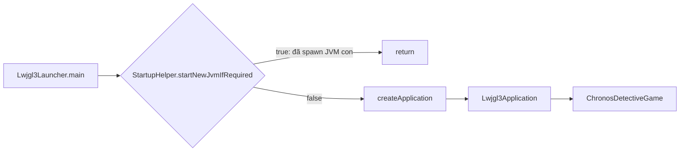
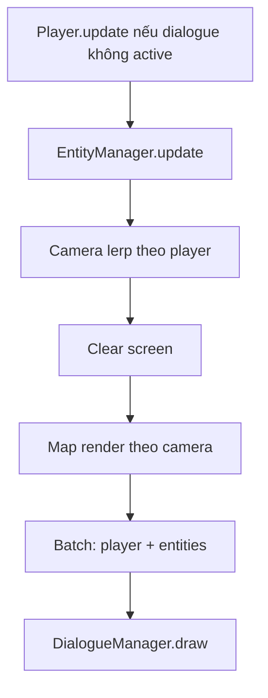

# Luồng code — ChronosDetective

Tài liệu mô tả luồng thực thi và trách nhiệm từng phần của game libGDX (Java).

## 1. Kiến trúc module (Gradle)

| Module | Vai trò |
|--------|---------|
| `core` | Logic game dùng chung: `ChronosDetectiveGame`, màn hình, entity, manager. |
| `lwjgl3` | Launcher desktop (LWJGL3): `main`, cấu hình cửa sổ, icon. |

Assets (bản đồ, texture) nằm dưới `assets/` theo convention libGDX.

## 2. Khởi động ứng dụng

1. **`Lwjgl3Launcher.main`**  
   Gọi `StartupHelper.startNewJvmIfRequired()`. Nếu trả về `true`, process hiện tại kết thúc (macOS / Linux NVIDIA đã restart JVM với tham số môi trường phù hợp).  
2. **`createApplication()`**  
   Tạo `Lwjgl3Application(new ChronosDetectiveGame(), config)` với VSync, FPS, kích thước cửa sổ, icon.  
3. **`StartupHelper`** (không thuộc logic game): xử lý Windows (temp dir cho native), macOS (`-XstartOnFirstThread`), Linux + NVIDIA (`__GL_THREADED_OPTIMIZATIONS=0`).

## 3. Vòng đời game — `ChronosDetectiveGame`

- **`create()`**  
  `VisUI.load()` → tạo `SpriteBatch` → `setScreen(new MenuScreen(this))`.  
- **`render()`**  
  `super.render()` — libGDX gọi `Screen.current.render(delta)`.  
- **`dispose()`**  
  `VisUI.dispose()`, `batch.dispose()`.

Luồng màn hình: **MenuScreen → GameScreen** (khi bấm NEW GAME).

## 4. Menu — `MenuScreen`

- **`show`**: rỗng (không override logic).  
- **Constructor**: `Stage` + `FitViewport(800,480)`, `Gdx.input.setInputProcessor(stage)`, bảng nút VisUI (`VisTextButton`).  
- **NEW GAME**: `game.setScreen(new GameScreen(game))`.  
- **EXIT**: `Gdx.app.exit()`.  
- **CONTINUE / SETTINGS**: chưa gắn listener (nút hiển thị only).  
- **`render`**: clear màu nền → `stage.act(delta)` → `stage.draw()`.

**Lưu ý kỹ thuật**: trường `skin` được khai báo nhưng không gán; `dispose()` gọi `skin.dispose()` có thể gây lỗi khi thoát màn menu — nên khởi tạo skin hoặc bỏ dispose tương ứng khi sửa sau.

## 5. Màn chơi — `GameScreen`

### `show()` — khởi tạo một lần khi màn được đặt làm current

Thứ tự gần đúng trong code:

1. `SpriteBatch` riêng cho màn (khác `game.batch` của `ChronosDetectiveGame`).  
2. Camera orthographic + `FitViewport(800, 480, camera)`.  
3. Load `map.tmx` → `OrthogonalTiledMapRenderer`.  
4. Texture `arrow.png` → `pointerSprite` (mũi tên gợi ý tương tác).  
5. `DialogueManager(viewport, camera)`, `EntityManager(pointerSprite)`.  
6. Player: texture `player2.png`, vị trí `(100,100)`, truyền `map` cho va chạm.  
7. `camera.zoom = 0.8f`.  
8. Thêm ví dụ: một `Item` (“Qua tao”) tại `(200,250)`. NPC mẫu đang comment.

### `render(delta)` — mỗi khung hình

1. Nếu `!dialogueManager.isActive()` → `player.update(delta)` (WASD, va chạm layer `Fences`).  
2. `entityManager.update(delta, player, dialogueManager)` — phím **E** khi đứng gần item/NPC.  
3. Camera: lerp vị trí về phía player (`lerp = 0.1f`).  
4. Clear → `mapRenderer.setView` + `render`.  
5. `batch` với `camera.combined`: vẽ player, `entityManager.draw`.  
6. `dialogueManager.draw(batch)` — UI hội thoại phủ lên (dùng `ShapeRenderer` + `BitmapFont` trong batch).

### `dispose()`

Giải phóng batch, player texture, map, dialogue manager, texture mũi tên. **Không** dispose `EntityManager` lists explicitly (textures item do caller tạo — hiện chỉ dispose một phần qua player/map).

## 6. Entity — `Entity`, `Player`, `Item`, `NPC`

### `Entity` (abstract)

Lưu `x, y`, `Sprite`; filter texture `Nearest`; `draw` delegate `sprite.draw`.

### `Player`

- **Di chuyển**: A/D/W/S, `speed * delta`.  
- **Va chạm**: layer tile `"Fences"`, ô 16px; kiểm tra hai điểm chân `(x+p, y+2)` và `(x+width-p, y+2)`. Ra ngoài biên layer → coi như va chạm.  
- **`isNear(Entity)`**: khoảng cách tâm–tâm &lt; 50.  
- **`dispose()`**: dispose texture của sprite.

### `Item`

Kích thước 16×16; `collected` ẩn khỏi vẽ và tương tác sau khi nhặt xong (sau 2 lần E trong flow item — xem EntityManager).

### `NPC`

Kích thước 32×32; `name`, `dialogue`; `getX/Y` từ sprite.

## 7. `EntityManager`

- **Danh sách**: `ArrayList<Item>`, `ArrayList<NPC>`.  
- **`update`**:  
  - **Item** chưa collected + player gần + `E` vừa bấm → `handleItemInteraction`.  
  - **NPC** + player gần + `E` → `handleNPCInteraction`.  
- **Item — hai nhịp E**:  
  - Lần 1 (dialogue đang tắt): mở dialogue (“Tham tu” + mô tả vật).  
  - Lần 2 (dialogue đang bật): đóng dialogue + `item.collect()`.  
- **NPC**: lần 1 mở dialogue; lần 2 chỉ đóng.  
- **`draw`**: vẽ item chưa collected và mọi NPC; nếu player gần → vẽ `pointerSprite` phía trên entity.

## 8. `DialogueManager`

- Trạng thái: `isActive`, `speakerName`, `dialogueText`.  
- **`draw`**: nếu active — hộp chữ nền đen bán trong suốt (theo `viewport` + `camera.zoom`), sau đó `batch` vẽ tên (vàng) và nội dung (trắng, wrap).  
- **`dispose`**: `ShapeRenderer`, `BitmapFont`.

## 9. Tóm tắt input

| Input | Ngữ cảnh |
|-------|----------|
| Click nút menu | `MenuScreen` / Stage |
| WASD | `Player.update` khi không có dialogue |
| E | `EntityManager` khi gần item/NPC |
| O | `GameScreen`: mở form Save game (chọn session + lưu) |
| ESC | `GameScreen`: mở form xác nhận thoát về Menu |

---

*Tài liệu phản ánh trạng thái codebase tại thời điểm tạo file; khi refactor màn hình hoặc dispose, cập nhật mục tương ứng.*
